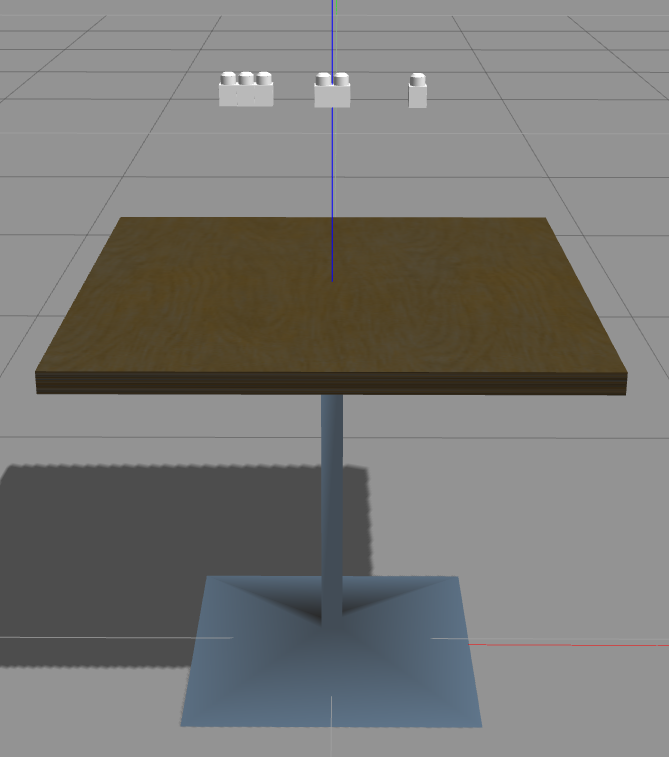

# Building with Mega Bloks

Problems:

- [x] roslaunch can not find the right model to instantiate
- [x] mega bloks models are in a different scale, need to convert to meters
- [ ] models are static, add inertia etc for physics
- [x] Make separate models for all colors
- [x] Create blender dae's for all colors

## Mega blok models

We have three different models currently: 1x1, 1x2, 1x3. The reason behind using Mega Bloks is in its size, being rather clunky they are easier for a robot to manipulate.

